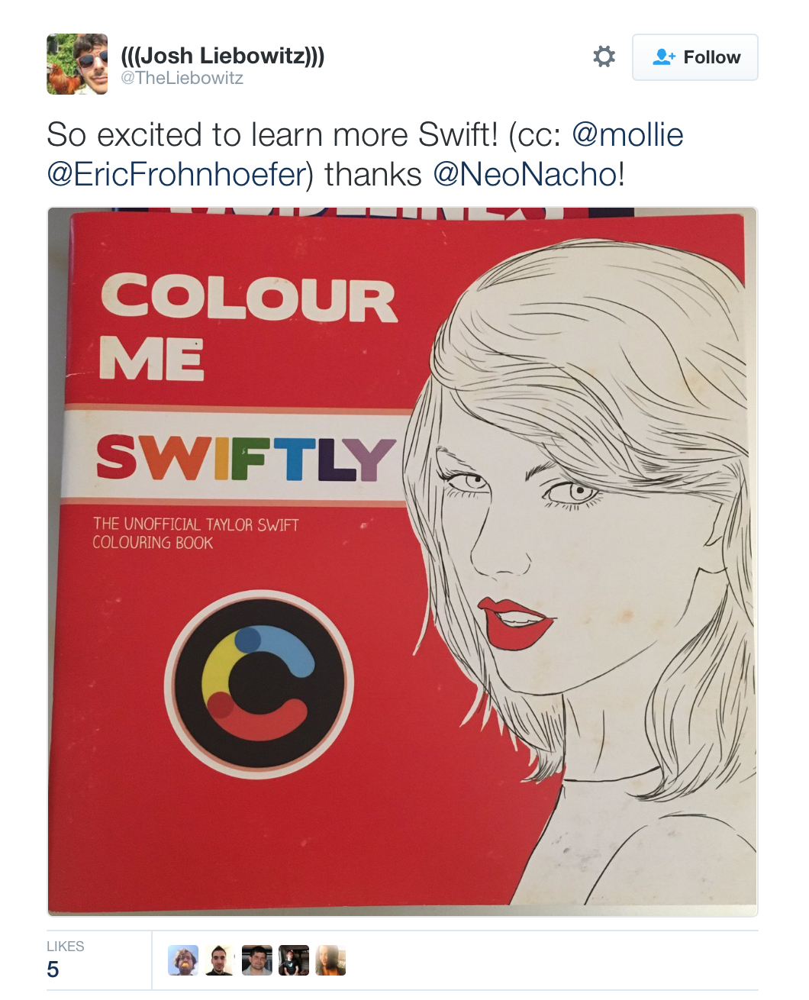
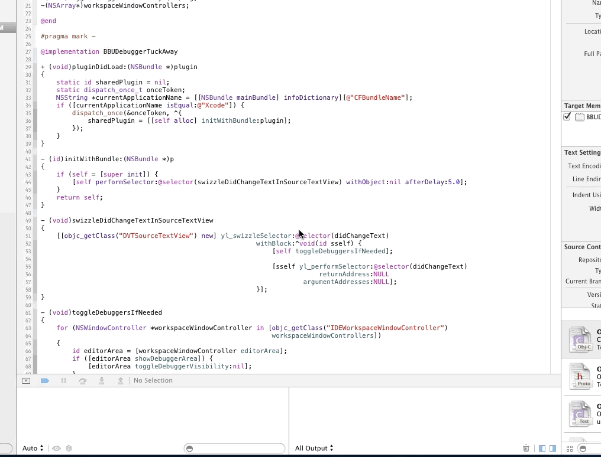
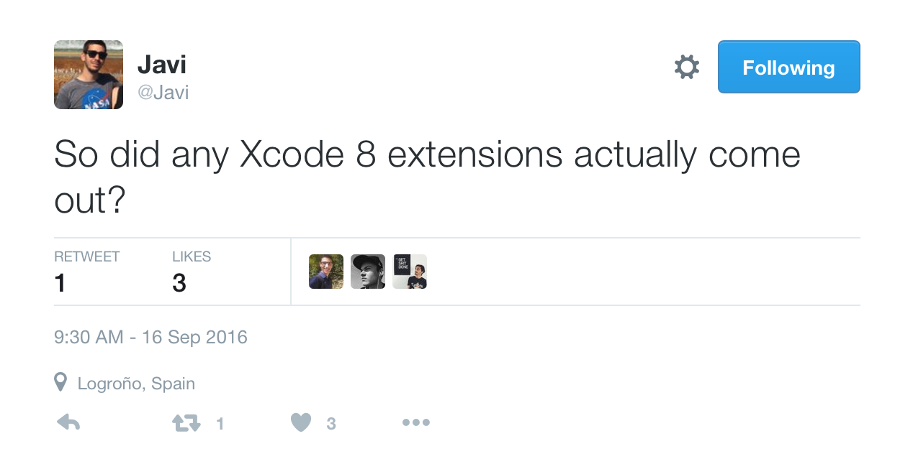

# Extending Xcode 8

## 🇫🇷Kit 2016

### Boris Bügling - @NeoNacho


<!-- use Poster theme, black -->

---

## Contentful


---



---

### Once upon a time, we had Xcode plugins



---

# Xcode 8 is under SIP

=> does not load third-party code bundles anymore

=> simply code signing them doesn't help

```
.../test.xcplugin/Contents/MacOS/test: code signature in 
(.../test.xcplugin/Contents/MacOS/test) not valid for use in process
using Library Validation: mapping process is a platform binary, but mapped file is not"
```

---

# Xcode Source Editor Extensions

---

# Agenda

- XcodeKit API
- How to build an extension
- Caveats
- A quick look at OSS extensions

---

# Tiny API at the moment

- Add menu items to the "Editor" menu
- They invoke a `XCSourceEditorCommand`
- Command gets current file and selection as input
- Commands are only available if a source file is open

---

# Extension environment

- Separate process, using XPC
- Can invoke the host app

---

# Example

```swift
func perform(with invocation: XCSourceEditorCommandInvocation, 
    completionHandler: (NSError?) -> Void ) -> Void {
        let buffer = invocation.buffer
        if let insertionPoint = buffer.selections[0] as? XCSourceTextRange {
            let currentLine = insertionPoint.start.line
            buffer.lines.insert("// More Awesome!", at: currentLine)
        }

        completionHandler(nil)
    }
```

---

# XcodeKit

---

# XCSourceEditorCommandInvocation

```swift
var buffer: XCSourceTextBuffer
var cancellationHandler: () -> Void
var commandIdentifier: String
```

---

# XCSourceTextBuffer

```swift
var completeBuffer: String
var contentUTI: String
var indentationWidth: Int
var lines: NSMutableArray
var selections: NSMutableArray
var tabWidth: Int
var usesTabsForIndentation: Bool
```

---

# XCSourceTextRange

```swift
var end: XCSourceTextPosition
var start: XCSourceTextPosition
```

---

# XCSourceTextPosition

```swift
var column: Int
var line: Int
```

---

# XCSourceEditorCommand (protocol)

```swift
func perform(with: XCSourceEditorCommandInvocation, 
	completionHandler: (NSError?) -> Void)
```

---

# XCSourceEditorExtension (protocol)

```swift
var commandDefinitions: [[XCSourceEditorCommandDefinitionKey : AnyObject]]

func extensionDidFinishLaunching()
```

---

# XCSourceEditorCommandDefinitionKey

```swift
static let classNameKey: XCSourceEditorCommandDefinitionKey
static let identifierKey: XCSourceEditorCommandDefinitionKey
static let nameKey: XCSourceEditorCommandDefinitionKey
```

---

# Distribution

- Mac App Store
- Developer signing

---



---

# Extended AppleScript dictionary

---

# Invoking AppleScript from Swift

```swift
func runAppleScript(_ script: String) throws -> String {
  if let scriptObject = NSAppleScript(source: script) {
  	var error: NSDictionary?
  	if let output: NSAppleEventDescriptor = 
  		scriptObject.executeAndReturnError(&error) {
  	  return output.stringValue ?? ""
  	} else if let error = error {
  	  let message = error["NSAppleScriptErrorMessage"] as! String
  	  throw Error.NSAppleScriptErrorMessage(message: message)
  	}
  }

  throw Error.FailedToExecuteAppleScript
}
```

---


```swift
let script = "tell application \"Xcode\"\n" +
	"set _workspace to active workspace document\n" +
    "set _workspaceFile to file of _workspace\n" +
    "set _posixTargetPath to POSIX path of _workspaceFile\n" +
    "return _posixTargetPath\n" +
"end tell"
print(try! runAppleScript(script))
```

---

# Demo

---

# Some existing extensions

---

# Search for more extensions on GitHub

We can just search for `XCSourceEditorCommand`

<https://github.com/search?p=3&q=XCSourceEditorCommand&type=Code&utf8=✓>

---

# Conclusion

- No more plugins 😢
- Current extensions API is quite limited
- We can try to get creative, though
- File radars for API ideas

---

# Thank you!

---

# Resources

<http://www.russbishop.net/xcode-extensions>

<https://www.cocoawithlove.com/blog/2016/06/25/policing-whitespace.html>

<http://ericasadun.com/2016/07/21/explorations-into-the-xcode-source-editor-extensions-underbelly-part-1/>

---

-

-


@NeoNacho

boris@buegling.com

http://buegling.com/talks
